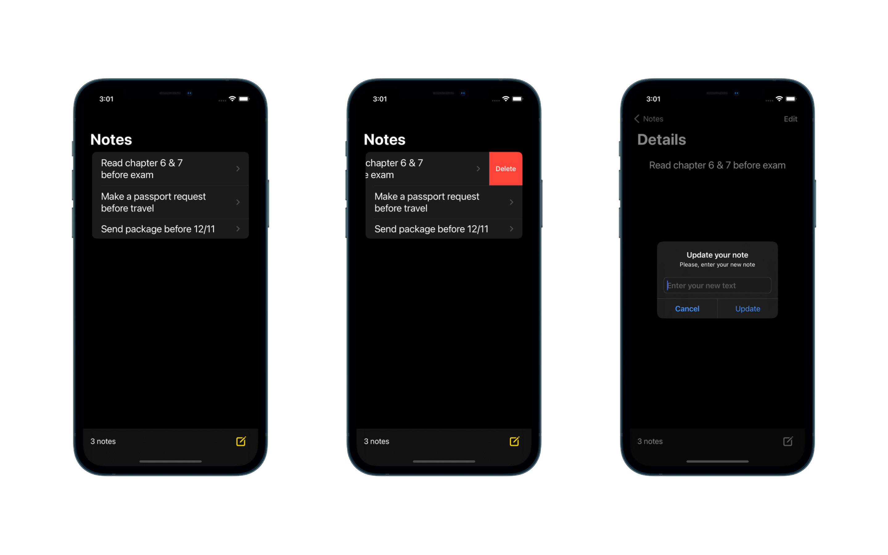

# Note

## A replica of the Apple Note application built with SwiftUI &amp; Firebase Firestore

The app features a Create, Read, Update and delete data functions to and from Firestore. 

### How to make it works:

- Create a new iOS project on the Firebase console. 
- Add your own GoogleService-Info.plist to the target 
- Set up Firebase Firestore to receive data 
- Run the Application 
- (SPM should fetch the packages itself).

### Screenshots of the Application:

